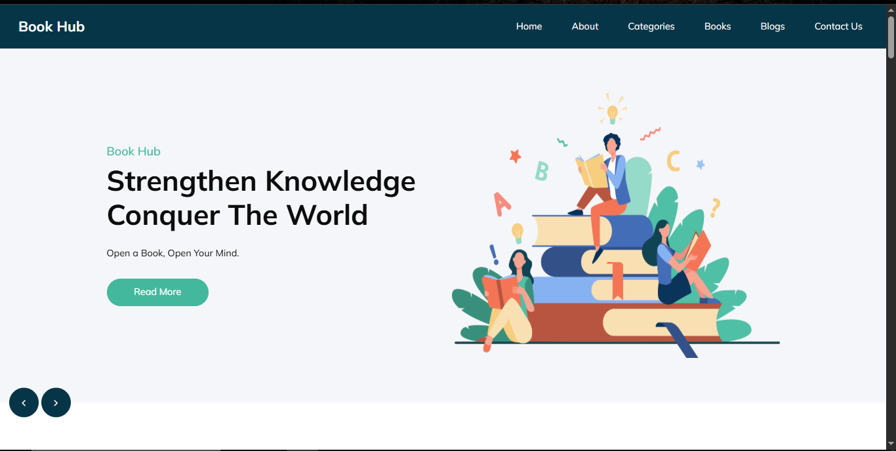
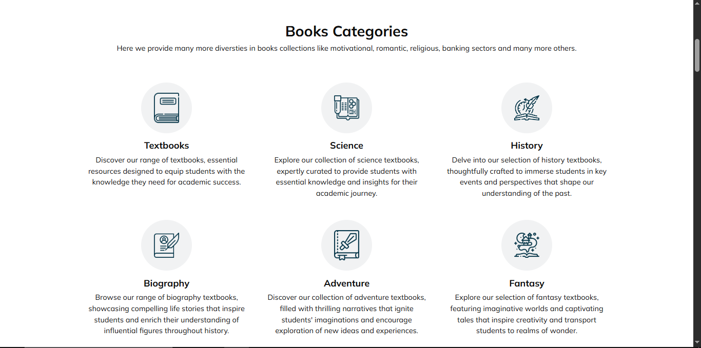
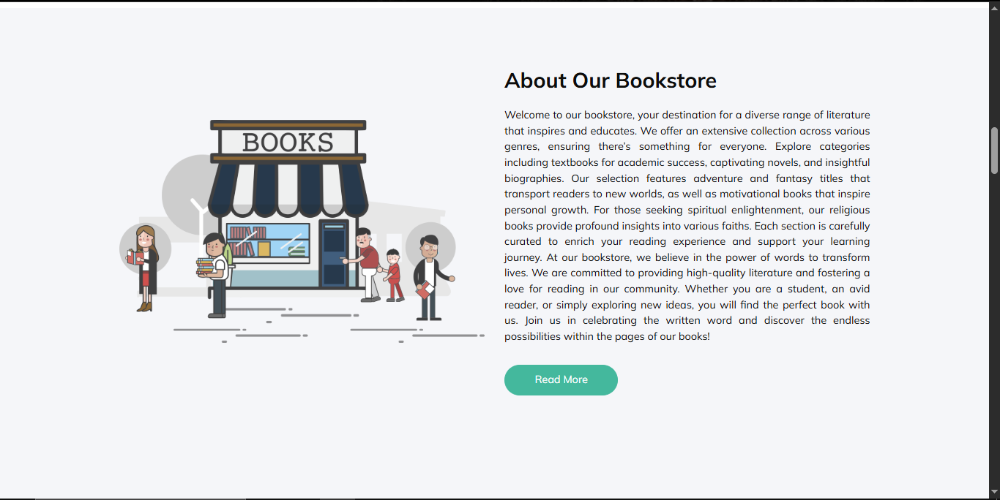
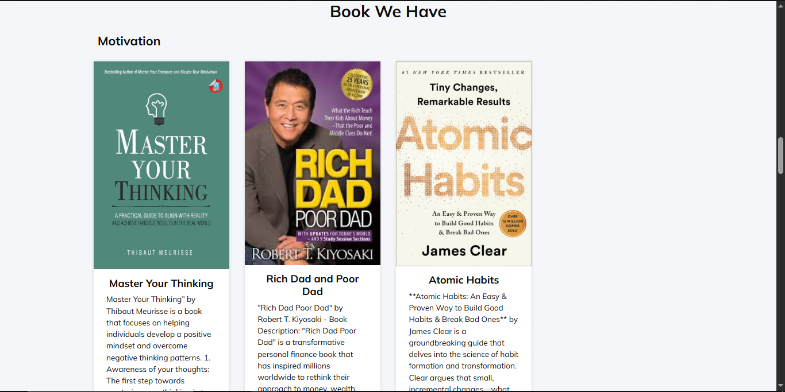
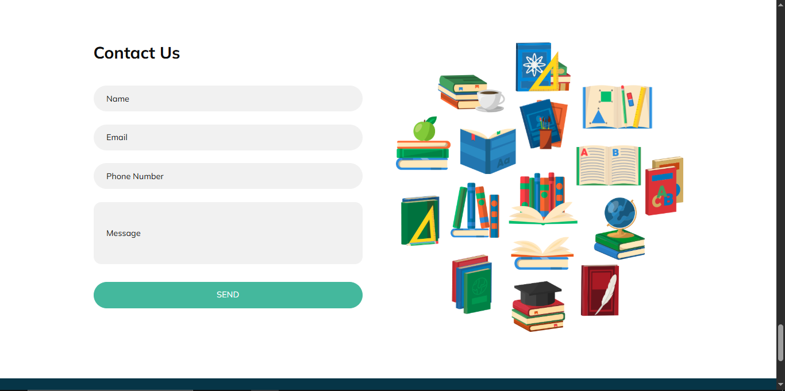
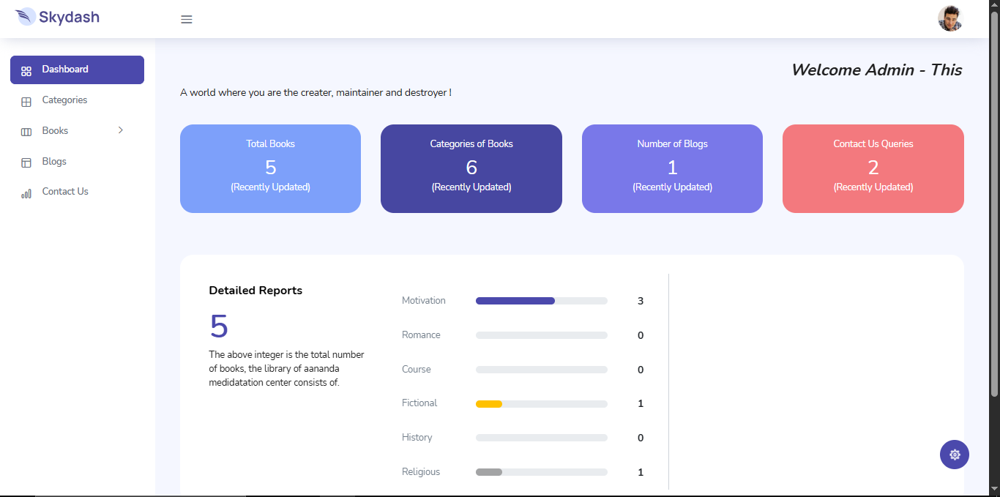
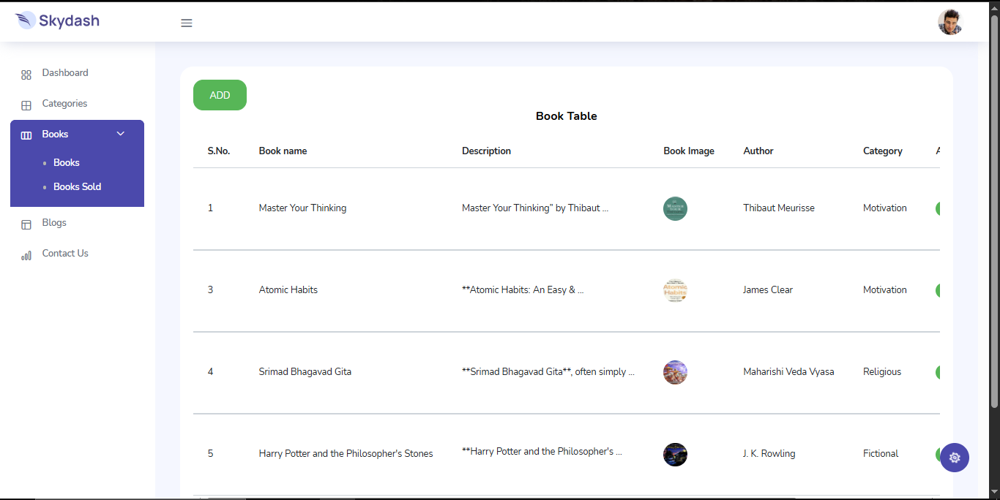
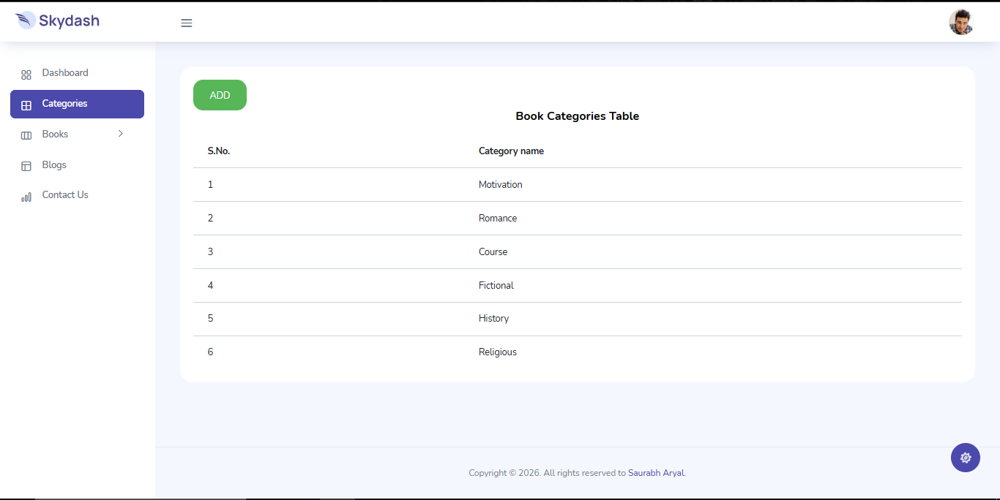

# Book Hub

A full-stack bookstore web application built with plain PHP and a custom lightweight MVC structure. Book Hub lets visitors browse books by category, read descriptions, and reach out to request a rental through an integrated contact system, while a separate admin panel gives the store owner full control over inventory, categories, and customer queries.

**Live demo:** localhost / available on request
**Tech stack:** PHP, MySQL, HTML5, CSS3, JavaScript, Bootstrap

---

## Overview

Book Hub was built to solve a real problem: giving a small local bookstore an online presence where customers can explore available titles by category, read about the store, and get in touch to request a book, without needing a full e-commerce checkout system. The project includes both the customer-facing site and a complete admin dashboard for managing the catalog.

---

## Features

**Customer-facing site**
- Home page with a hero banner carousel and store introduction
- Books Categories page covering Textbooks, Science, History, Biography, Adventure, Fantasy, Motivation, Romance, Course, and Religious genres
- Books listing page with cover images, descriptions, and authors, grouped by category
- About page with store story and founder message
- Blogs section for store updates and articles
- Contact Us form that doubles as the book rental request channel, storing name, email, phone number, and message directly into the database

**Admin panel (Skydash)**
- Secure admin login system
- Dashboard with live counts of total books, categories, blogs, and contact queries
- Category-wise detailed reports with progress bars showing book distribution
- Full Books management (Add, Edit, Delete) with a dedicated Books Sold tracking sub-section
- Categories management (Add, Edit, Delete)
- Blogs management for publishing and unpublishing posts
- Contact Us query management to track and address customer requests

---

## Tech Stack

| Layer | Technology |
|---|---|
| Backend | PHP (custom lightweight MVC structure) |
| Database | MySQL |
| Frontend | HTML5, CSS3, JavaScript, Bootstrap |
| Admin Theme | Skydash Admin Dashboard |
| Tools | phpMyAdmin, XAMPP/Localhost |

---

## Database Structure

The application uses 7 core tables:

- `tbl_books` — book name, description, image, author, category, status, dates
- `tbl_book_categories` — category name and display position
- `tbl_blogs` — title, description, image, publish status
- `tbl_aboutus` — store about content and image
- `tbl_contactus` — name, email, phone, message, status (Addressed/Unaddressed), query date
- `tbl_admin_login` — admin credentials
- `tbl_country` — country and zone reference data

---

## Screenshots

### Home Page


### Books Categories


### About Page


### Book Listings


### Contact Us


### Admin Dashboard


### Admin Books Management


### Admin Categories Management


---

## Project Structure

```
book_hub/
├── assets/
├── connection/
│   └── connection.php
├── includes/
│   └── header.php
├── functions/
│   └── function.php
├── css/
├── js/
├── images/
├── system_panel/          # Admin dashboard (Skydash)
│   ├── pages/
│   │   ├── books/
│   │   └── categories/
│   ├── css/
│   ├── js/
│   └── index.php
├── index.php
├── about.php
├── categories.php
├── books.php
├── blogs.php
├── contact.php
├── login.php
└── login_process.php
```

---

## Getting Started

**Prerequisites:** PHP 7.4+, MySQL, a local server environment such as XAMPP or WAMP

1. Clone the repository
   ```
   git clone https://github.com/saurabharyal10/Book_Hub.git
   ```
2. Place the project folder inside your local server's root directory (e.g. `htdocs` for XAMPP)
3. Create a MySQL database named `db_book_hub`
4. Import the provided SQL file into the database via phpMyAdmin
5. Update database credentials in `connection/connection.php` if needed
6. Visit `http://localhost/book_hub/` in your browser
7. Access the admin panel at `http://localhost/book_hub/system_panel/` using the admin credentials set in `tbl_admin_login`

---

## Author

**Saurabh Aryal**
Full Stack Developer & Data Analyst
[Portfolio](https://saurabh-aryal.com.np) · [LinkedIn](https://www.linkedin.com/in/saurabh-aryal-0b4b80209/) · [GitHub](https://github.com/saurabharyal10)
